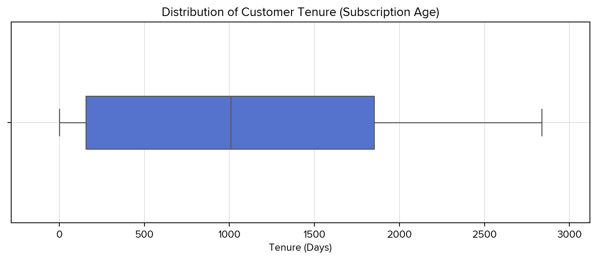
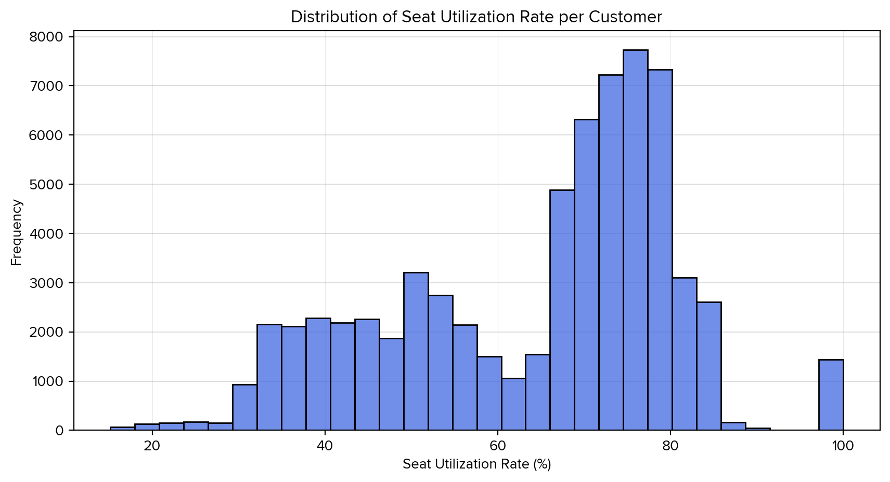

# Exploratory Data Analysis for SaaS

###### _Tools: Python (Pandas, NumPy, Matplotlib, Seaborn), Microsoft Excel
<br/>


## **Introduction**
TalentNest is a Seattle-based HR Systems SaaS company founded in 2017, serving customers worldwide across a range of company sizes from small businesses to large enterprises. Its platform includes features such as Employee Directory, Onboarding Workflows, Time-Off Tracking, Payroll, Advanced Analytics, and Employee Surveys.

This project conducts an Exploratory Data Analysis (EDA) of customer demographics and segmentation to uncover insights into customer profiles, product usage behavior, engagement, and retention. The aim is to identify patterns that can help the company better target new customers, strengthen relationships with existing ones, and guide improvements in both its services and overall customer experience.

## **Executive Summary**
This analysis highlights clear retention challenges in Starter and Basic plans, strong growth opportunities in Enterprise and Professional tiers, and the critical role of engagement metrics (logins, session duration, and onboarding) in predicting churn. Insights directly inform marketing strategies for targeted retention campaigns and product development priorities that deepen engagement and unlock long-term value.

## **Dataset Structure**
The TalentNest customer segmentation dataset consists of over 67,500 records and 52 variables, spanning the period from September 2017 to June 2025. It combines demographic, financial, subscription, engagement, and retention data from customers worldwide, ranging from small businesses to large enterprises. The dataset captures both long-term account histories and short-term usage behaviors, making it well-suited for identifying customer profiles, analyzing product adoption patterns, measuring engagement levels, and exploring factors that influence retention and churn.

## **New Variables**
To enhance the dataset, five derived variables were created and integrated using Excel formulas and lookups:
* **Region** – added by pulling data from a reference table of countries and regions using a VLOOKUP formula.
* **Company Size Category** – generated from the company size field with an IFS formula to classify businesses into categories.
* **Account Age (Days)** – calculated by subtracting the signup date from the churn date for churned accounts, or from June 20, 2025 (the dataset end date) for active accounts.
* **Revenue per Seat** – derived with a formula dividing lifetime customer value by employee count.
* **Average Monthly Spend (USD)** – computed by dividing lifetime customer value by total subscription months.
These derived fields were appended to the original dataset, allowing for standardized comparisons and more meaningful insights across customers.

## **Data Cleaning**
The dataset was first reviewed to establish its grain, identify critical columns, and ensure consistency in definitions across demographic, financial, subscription, and engagement fields. Obvious issues such as duplicate records, inconsistent country names, and formatting errors were corrected, while records with missing values in non-critical columns were excluded from the analysis.

Additional cleaning steps included standardizing categorical fields (e.g., company size classifications), validating date fields, and ensuring numerical measures were properly formatted for analysis. Finally, the dataset was augmented with derived variables, such as account age and revenue per seat, to support deeper segmentation and pattern exploration.

## **Univariate Plots**

### Country distribution

TalentNest’s customer base is highly concentrated in the United States (34.6%), with the United Kingdom (11.2%) and Canada (5.9%) as secondary markets, while other countries individually contribute smaller shares.

```python
# Country distribution (percentages)
United States     34.58
United Kingdom    11.19
Canada             5.89
Australia          5.04
Germany            3.79
India              3.60
Netherlands        2.70
France             2.50
Singapore          2.20
Brazil             1.89
```


### Industry distribution

Technology companies form the largest share of customers (21.4%), followed by Professional Services (10.0%), Healthcare (9.5%), and Financial Services (8.5%), with a wide mix of other industries making up the remainder.

```python
# Industry frequency (counts)
Technology               21.42
Professional Services    10.03
Healthcare                9.54
Financial Services        8.50
Education                 8.13
Manufacturing             7.49
Media & Marketing         5.28
Hospitality               4.90
Nonprofit                 4.49
Retail                    4.40
Real Estate               3.65
Construction              2.98
Legal                     2.25
Logistics                 2.09
Telecommunications        1.74
```


### Subscription Plan distribution

The Professional plan is the most widely adopted subscription tier, indicating it serves as the standard entry point for customers.

```python
# Most common subscription plan
Professional
```


### Company Size

Customer organizations range from single-employee firms to global enterprises of 80,000 employees, with a median size of 129 and three-quarters of companies having fewer than 443 employees.

```python
# Five-number summary of company sizes
Min employee count: 1
Q1 (25th percentile): 30
Median: 129
Q3 (75th percentile): 443
Max employee count: 80000
```


### Company Revenue

Annual revenue spans from $10K to $30.4B, though the median sits at $18.1M, highlighting a customer base dominated by mid-sized businesses despite some very large outliers.

```python
# Five-number summary for annual revenue
Min: 10000
Q1 (25th percentile): 3185250
Median: 18143000
Q3 (75th percentile): 84360000
Max: 30400000000
```


Because a few companies earn in the billions, the revenue distribution is extremely skewed, which makes it hard to see patterns in the majority of the data. By capping at the 95th percentile, we reduce the influence of outliers and highlight trends that better represent most companies.


### Average Monthly Spend

Monthly spend is highly skewed, with a median of $1,017 but a long tail of heavy spenders reaching over $830K per month.

```python
# Summary statistics of monthly spend in USD
Mean: 6,574
Min: 0
Q1 (25th percentile): 122
Median: 1,017
Q3 (75th percentile): 5,316
Max: 831,433
```


The distribution of average monthly spend is heavily skewed by a small number of companies with extremely high values, which makes it difficult to see trends among the majority of customers. To keep the chart readable and highlight typical customer patterns, the visualization is capped at the 95th percentile.


### Lifetime Value

Customer lifetime value is highly skewed, with a median of $27.7K but a long tail of accounts reaching up to $17.2M.

```python
# Summary statistics of lifetime value in USD
Mean: 267,479
Min: 0
Q1 (25th percentile): 1,413
Median: 27,698
Q3 (75th percentile): 182,399
Max: 17,233,620
```


### Revenue per Seat

The average revenue per seat is $401, with most customers clustered between $46 and $613, indicating broad variability in seat-level monetization.

```python
# Five-number summary for annual revenue
Mean Revenue per Seat: 401
Min: 0
Q1 (25th percentile): 46
Median: 285
Q3 (75th percentile): 613
Max: 2,671
```


### Account Age

Accounts span from 1 day to 7.8 years old, with a median age of just over 3 years (1,151 days), suggesting a substantial base of long-standing customers.

```python
# Five-number summary for account age
Min account age: 1 days
Q1 (25th percentile): 329 days
Median: 1151 days
Q3 (75th percentile): 1966 days
Max: 2838 days
```


### Tenure in Days

Median subscription tenure is 1,007 days, though ranges from brand-new signups to accounts active for nearly 8 years.

```python
# Subscription age in days
Median Tenure: 1007 days
Range: 0 - 2836 days
```



### Onboarding Completion %

Onboarding is generally strong, with a median completion rate of 75%, but only 4.4% of customers fully complete all onboarding steps.

```python
# Onboarding Completion
Median Onboarding Completion: 75%
Range: 20% - 100%
Percentage Fully Onboarded: 4.4%
```


### Average Session Duration

Users typically spend around 10 minutes per session, with most sessions falling between 7 and 13 minutes.

```python
# Session duration
Median: 10 minutes
Range: 0 - 21 minutes
```


```python
Min: 0
Q1 (25th percentile): 7
Median: 10
Q3 (75th percentile): 13
Max: 21
```


### Number of Active Users

Accounts average 344 active users, reflecting wide variation in company size and adoption.

```python
# Mean number of active users
344
```

chart13


### Number of Modules Used

The most common usage pattern is four modules per active user, suggesting moderate engagement across the platform’s features.

```python
# Most common number of modules used per active user
4.0
```


### Number of Integrations

Customers use an average of 6 integrations, with 7 being the most common, showing a tendency toward multi-tool connectivity.

```python
# Number of integrations
Mean: 6.1
Mode: 7.0
```


### Logins Last 30 Days

Login activity is steady, with a median of 15 logins per month per user, and most falling in the 8–23 range.

```python
# Logins last 30 days
Min: 0.0
Q1 (25th percentile): 8.0
Median: 15.0
Q3 (75th percentile): 23.0
Max: 30.0
```


### Seat Utilization Rate

On average, companies utilize 64.4% of their purchased seats, leaving a substantial portion underused.

```python
# Mean seat utilization rate
64.4%
```



### Support Tickets per User

Customers submit about 0.25 support tickets per user each month, indicating relatively low individual demand for assistance.

```python
# Mean support tickets per user per month
0.25
```


### Total Support Tickets

Companies generate an average of 1,724 support tickets over their lifecycle, reflecting varying levels of platform reliance.

```python
# Average total company support tickets
1724.0
```

### Engagement Score

The mean engagement score is 55.2, suggesting moderate but uneven user interaction with the platform.

```python
# Mean engagement score
55.24
```


### Support Load by Industry

Aerospace, Healthcare, and Government customers record the highest average ticket volumes, while Real Estate and Agriculture submit the fewest.

```python
# Average support tickets per company by industry
Aerospace                4112
Healthcare               2637
Government               2518
Telecommunications       2376
Financial Services       2357
Retail                   2179
Energy & Utilities       2023
Manufacturing            1967
Legal                    1810
Hospitality              1765
Education                1700
Construction             1660
Logistics                1576
Technology               1533
Nonprofit                1310
Entertainment            1269
Professional Services    1110
Media & Marketing        1104
Real Estate               887
Agriculture               854
```


### Churned distribution

A majority of accounts remain active (81%), with 16.5% churned and 2.6% never subscribed.

```python
# Churn distribution
No                80.97
Yes               16.48
Not Subscribed     2.55
```


### Time to Churn

Median churn occurs just 16 days after signup, pointing to very early disengagement for at-risk customers.

```python
# Median time to churn
16.0 days
```


### Churn Rate by Plan

Churn is highest among Starter (29.2%) and Basic (28.2%) plans, while Enterprise (3.9%) and Professional (9.5%) retain customers far more effectively.

```python
# Churn rate by subscription plan
Basic           28.23
Enterprise       3.86
Professional     9.52
Starter         29.21
```


## Univariate Analysis

The univariate results highlight TalentNest’s strong concentration in English-speaking and European markets, particularly the United States, United Kingdom, and Canada, which together account for over half of the customer base. Technology companies are the most represented industry segment, followed by professional services, healthcare, and financial services, suggesting that adoption is strongest among knowledge-driven sectors. While company sizes and revenues vary widely, from startups to multinational corporations, the median organization is a mid-sized business with 129 employees and $18.1M in annual revenue. Subscription adoption is led by the Professional plan, while lower-tier Starter and Basic plans are less common but associated with higher churn risk.

Financial measures reveal considerable skew, with customer lifetime value (LTV) and average monthly spend dominated by a small group of high-value accounts. The median LTV is just $27.7K, compared to a mean of $267K, reflecting a heavy-tailed distribution. Similarly, revenue per seat averages $401 but varies significantly depending on company profile and product utilization. Engagement metrics paint a picture of moderate but consistent platform use: typical sessions last 10 minutes, customers adopt around four modules and six integrations, and users log in 15 times per month. However, seat utilization averages just 64%, suggesting inefficiencies in license adoption.

Support and retention metrics uncover important risks and opportunities. Although the average support demand per user is low, industries like Aerospace, Healthcare, and Government submit disproportionately high ticket volumes, potentially signaling sector-specific service needs. Churn patterns show that 16.5% of customers have left, with most churn happening quickly (half within 16 days of signup). Notably, churn rates differ sharply by plan: Enterprise customers exhibit strong retention at just 3.9% churn, while Starter and Basic customers churn at nearly 30%. Together, these findings indicate a dual customer base of stable, high-value enterprise accounts and more volatile small-business customers, underscoring the importance of early onboarding, seat utilization improvement, and tailored support strategies.


## Bivariate Plots

### Seat Utilization vs. Company Size

Seat utilization rises steadily with company size, averaging ~65% in very small firms but reaching ~75% in enterprises with 1,000+ employees.

```python
# Seat utilization rate summary by company size (%):
              min_value     Q1  median     Q3  max_value   mean                                               
1-10              16.67  50.00   66.67  75.00     100.00  65.34
11-50             15.15  41.94   52.63  65.85      92.31  53.83
51-200            15.50  49.04   69.41  76.72      86.54  63.31
201-500           30.09  67.33   73.32  78.03      85.33  69.20
501-1,000         30.13  71.47   74.74  78.10      85.09  73.73
1,001-5,000       65.03  72.06   75.04  77.85      85.01  74.98
5,001-10,000      70.00  72.53   74.91  77.55      80.00  75.00
10,001+           70.37  73.08   75.65  77.34      79.72  75.13
```


### Churned vs. Engagement Score

Churned accounts have far lower engagement scores (mean 26.5) than retained ones (mean 55.5), showing a clear link between usage and retention.

```python
# Mean and median engagement score by churn status:
                 mean  median            
No              55.50   54.78
Yes             26.52   26.03
Not Subscribed  17.44   17.32
```


### Churned vs. Onboarding %

Retained customers complete more of onboarding (median 75%) than churned ones (median 60%), while non-subscribers remain much lower at 40%.

```python
# Mean and median onboarding completion % by churn status:
                 mean  median        
No              73.80    75.0
Yes             60.06    60.0
Not Subscribed  39.89    40.0
```


### Churned vs. Modules Used

Active accounts typically use 7 modules, compared to 5 for churned and just 1 for non-subscribers, suggesting breadth of adoption correlates with retention.

```python
# Mean and median modules used per active user by churn status:
                mean  median     
No              7.15     7.0
Yes             5.22     4.0
Not Subscribed  1.02     1.0
```


### Subscription Plan vs. Churn

Enterprise customers churn the least (3.9%), while Starter (29.2%) and Basic (28.2%) plans have the highest churn rates.

```python
# Churn rate by subscription plan:
is_churned           YES     NO
Basic              28.23  71.77
Enterprise          3.86  96.14
Professional        9.52  90.48
Starter            29.21  70.79
```


### Industry vs. LTV

Aerospace companies have the highest lifetime value (~$408K), while industries such as Legal and Hospitality are on the lower end (~$240K–$250K).

```python
# Mean Lifetime Value (USD) per Industry:
Aerospace                407943.25
Agriculture              231987.60
Construction             310984.15
Education                276286.28
Energy & Utilities       268871.31
Entertainment            248761.96
Financial Services       280804.15
Government               310436.93
Healthcare               263163.74
Hospitality              247379.23
Legal                    241248.00
Logistics                301161.04
Manufacturing            261445.15
Media & Marketing        266412.44
Nonprofit                257368.31
Professional Services    263538.33
Real Estate              273853.81
Retail                   273182.49
Technology               262116.11
Telecommunications       289163.81
```


### Company Size vs. Churn

Churn is minimal for most size groups but spikes sharply among small firms with 11–50 employees (54%) and very large enterprises (80% at 10,001+).

```python
# Churn % by company size bucket:
1-10             5.33
11-50           54.09
51-200           2.86
201-500          2.24
501-1,000        1.81
1,001-5,000      3.15
5,001-10,000     8.70
10,001+         80.00
```


### LTV vs. Engagement Score

Lifetime value is strongly correlated with engagement (r = 0.64), showing that more active customers generate higher long-term revenue.

```python
# Correlation coefficient between LTV and Engagement Score
0.64
```


### Avg Monthly Spend vs. LTV

LTV scales closely with average monthly spend (r = 0.77), following a positive linear relationship.

```python
# Correlation coefficient between LTV and Avg Monthly Spend
0.77

#Linear fit
LTV = 34.38 * AvgMonthlySpend + 41491.66
```


### Churned vs. Support Tickets/User

Churned accounts submit far more support tickets per user (mean 0.89) than retained ones (0.12), suggesting support strain is linked to attrition.

```python
# Support Tickets per User per Month by Churn Status:
                mean  median   min   max  count                     
No              0.12    0.10  0.00  0.57  54706
Yes             0.89    0.81  0.03  2.54  11134
Not Subscribed  0.06    0.06  0.00  0.22   1726
```


### Country vs. Churn Rate

Smaller markets such as North Macedonia (28.6%) and Namibia (25.9%) show the highest churn rates, well above the global average.

```python
# Countries with the highest churn rate (%):
North Macedonia    28.57
Namibia            25.93
Peru               23.08
Iceland            22.95
Bolivia            22.22
Nepal              21.43
Austria            21.39
Sri Lanka          21.21
Colombia           21.21
Qatar              21.21
Romania            20.74
Croatia            20.31
Kazakhstan         20.00
Georgia            20.00
Zambia             20.00
```


### Plan vs. Modules Used

Module adoption scales with subscription tier, from just 1 in Free plans to 10 in Enterprise accounts.

```python
# Median modules used per subscription plan:
Free             1.0
Starter          4.0
Basic            6.0
Professional     8.0
Enterprise      10.0
```


### Logins vs. Session Duration

Logins and session duration are highly correlated (r = 0.89), indicating heavier login activity coincides with longer engagement per session.

```python
# Correlation between logins (last 30 days) and avg session duration
0.89
```


### Company Size vs. Active Users

Company size has little correlation with daily active user logins (r = 0.07), suggesting usage intensity does not scale directly with workforce size.

```python
# Correlation between company size and avg logins per day:
0.07
```


### Plan vs. Monthly Spend

Average monthly spend rises steeply by plan, from ~$299 in Basic to over $22,700 in Enterprise.

```python
# Mean monthly spend per subscription plan (USD):
Basic             298.83
Enterprise      22774.82
Free                0.00
Professional     4537.01
Starter           450.85
```


### Integrations vs. Churn

Retained accounts average more integrations (mean 6.3) than churned ones (5.4), while non-subscribers rarely exceed 2.

```python
# Number of Integrations by Churn Status:
                mean  median  min  max  count                  
No              6.32     6.0    2   12  54706
Yes             5.40     5.0    2   12  11134
Not Subscribed  1.99     2.0    1    3   1726
```


## Bivariate Analysis

The bivariate analysis highlights several important dynamics in customer behavior across different account attributes. Country-level comparisons reveal that churn is disproportionately concentrated in smaller markets such as North Macedonia and Namibia, both far exceeding the global churn average. This suggests that geographic context may play a stronger role in churn dynamics than sheer user volume. Subscription tier also emerges as a consistent differentiator, with higher-tier plans not only commanding greater spend but also showing broader product adoption. Enterprise users engage with an average of 10 modules compared to only one among Free plans.

Engagement measures show clear internal consistency. Logins and session duration are strongly correlated (r = 0.89), indicating that accounts logging in more frequently also tend to stay longer per session. In contrast, company size has little relationship to daily active user intensity (r = 0.07), suggesting that user behavior depends more on product fit than organizational scale. Finally, integration usage appears linked to retention: retained accounts maintain more integrations on average than churned ones, reinforcing the idea that deeper product embedding reduces the likelihood of churn. Together, these findings underscore that churn and retention are shaped more by depth of engagement and tier-driven product adoption than by simple demographic factors like company size.

## Multivariate Plots

### Churned vs. Onboarding % & Engagement Score

Retained users show higher engagement scores (mean ≈ 55) and onboarding completion (≈ 71%) compared to churned and unsubscribed accounts, underscoring the importance of early adoption in driving retention.

```python
# Engagement score & onboarding % by churn status:
               engagement_score        onboarding_completion_percent       
                           mean median                          mean median                            
No                        54.51  53.59                         71.25   74.0
Yes                       26.51  26.03                         60.00   60.0
Not Subscribed            17.44  17.32                         39.90   40.0
```


### Subscription Plan vs Company Size of all Users

Starter and Professional plans dominate across most company sizes, while Enterprise usage is concentrated among firms with over 100 employees.

```python
# Concentration of Users by Subscription Plan & Company Size
              1-20  21-40  41-100  101-10,000  10,001+
Free          1067    241     194         122        0
Starter       5149   5008    4005        5721        0
Basic         4287   2082    1422        1042        0
Professional  1218   1452    3068       16031        0
Enterprise     100    108     708       13697       20
```

### Subscription Plan vs Monthly Spend of all Users

Spending scales sharply with plan tier, with Enterprise and Professional users driving the majority of revenue at $1,000+ monthly spend levels.

```python
# Concentration of Users by Subscription Plan & Monthly Spend
              $0-$50  $51-$100  $101-$500  $501-$1,000  $1,000+
Free            1726         0          0            0        0
Starter         4973      2946       6790         2975     2496
Basic           2689      1974       3155          612      767
Professional     449       509       2323         2105    16442
Enterprise        17        14        189          219    14196
```

### Subscription Plan vs Average Session Duration of all Users

Higher-tier plans, particularly Professional and Enterprise, concentrate more users in the longer average session duration ranges (9–17+ minutes).

```python
# Concentration of Users by Subscription Plan & Average Session Duration
               0-4   5-8  9-12  12-16   17+
Free           181  1045   500      0     0
Starter       1932  5994  6489   4372  1393
Basic          825  2641  3018   2060   653
Professional   707  4414  8717   6020  1970
Enterprise     175  2635  6142   4320  1363
```


### Monthly Spend vs Company Size of all Users

Smaller firms (<100 employees) mostly cluster at lower spend levels, while larger enterprises (101–10,000+) dominate the $5k+ range.

```python
# Concentration of Users by Monthly Spend & Company Size
        0-25  26-100  101-500  501-1,000  1,000+
$100   12185    2965      147          0       0
$1k     2702   11746     3893         26       1
$2.5k      0    1314     7767         93       4
$5k        0      21     6508        623      11
$5k+       0       0     3840       9731    3989
```

### Monthly Spend vs Session Duration of all Users

Users with higher spend tiers ($2.5k–$5k+) are more likely to sustain longer average session durations (9–17+ minutes).

```python
# Concentration of Users by Monthly Spend & Session Duration
        0-4   5-8  9-12  12-16   17+
$100   2347  5680  4107   2334   829
$1k    1689  4914  6056   4085  1624
$2.5k   129  1599  3752   2700   998
$5k      93  1260  2866   2118   826
$5k+    196  3005  7270   5093  1996
```

### Monthly Spend vs Onboarding Completion of all Users

Accounts spending $5k+ per month are heavily concentrated at higher onboarding completion rates (80–100%), suggesting adoption depth links to revenue.

```python
# Concentration of Users by Monthly Spend & Session Duration
       20%   40%   60%   80%  100%
$100   139  1732  4878  4751  3797
$1k      7  1188  4899  5936  6338
$2.5k    0   503  2038  2790  3847
$5k      0   389  1560  2132  3082
$5k+     0   932  3866  5262  7500
```


### Average Monthly Spend by Subscription Plan for Top-Spending Industries

Enterprise spending is highest in industries such as Aerospace, Telecommunications, and Construction, with Aerospace averaging over $55k monthly.

```python
# Average Monthly Spend by Subscription Plan for Top Industries
subscription_plan    Free  Starter    Basic Professional  Enterprise
industry                                                            
Aerospace            $nan  $192.60  $284.14    $5,899.23  $55,539.14
Construction        $0.00  $424.27  $306.57    $4,956.58  $24,061.77
Government          $0.00  $396.42  $340.67    $4,538.74  $23,379.76
Logistics           $0.00  $451.14  $326.13    $4,300.86  $24,933.18
Telecommunications  $0.00  $503.18  $297.39    $4,006.84  $20,979.48
```


### Average Monthly Spend by Subscription Plan for Top-Spending Industries

```markdown
Average Monthly Spend by Subscription Plan for Selected Countries:
subscription_plan   Free  Starter    Basic Professional  Enterprise
country                                                            
Brazil             $0.00  $442.09  $375.79    $4,539.34  $26,995.30
Germany            $0.00  $462.75  $308.48    $4,877.91  $22,385.30
Indonesia          $0.00  $436.48  $771.03    $4,756.24  $15,280.95
Pakistan           $0.00  $373.62  $409.85    $3,809.81  $31,649.93
United States      $0.00  $437.40  $291.63    $4,503.85  $22,871.18
```


### Correlation Scatterplot Matrix

The scatterplot matrix highlights that user engagement metrics (engagement score, logins, session duration, and onboarding completion) are highly interconnected, with correlations ranging from 0.67 to 0.89. These strong relationships suggest that users who log in more frequently also tend to stay longer per session, complete more of their onboarding, and achieve higher engagement scores overall.

In contrast, Lifetime Value (LTV) shows only a moderate positive relationship with engagement score (r=0.64) and weak associations with other variables, such as logins (r=0.18), session duration (r=0.18), and onboarding (r=0.10). This pattern indicates that while engagement behaviors move together closely, their translation into financial outcomes like LTV is less direct, implying that other external or structural factors may play a larger role in driving revenue.


## Multivariate Analysis

The multivariate analysis reveals clear differences in user behavior and outcomes when multiple factors are considered together. For instance, churned users consistently showed lower engagement scores and onboarding completion percentages, highlighting the combined importance of both early adoption and sustained engagement for retention. Similarly, subscription plans varied not only by company size but also by spend, session duration, and onboarding completion, underscoring that higher-tier plans are associated with both greater investment and deeper platform utilization.

Patterns linking financial commitment with engagement outcomes were also evident. Users with higher monthly spend generally exhibited longer session durations and higher onboarding completion, suggesting that investment and engagement reinforce one another. However, when broken down by company size, spend distribution was heavily skewed, with the largest enterprises dominating the highest spend categories, while smaller companies concentrated in the lower spend ranges.

Finally, industry-level comparisons showed that top-spending sectors like Aerospace and Logistics tended to cluster in higher-tier plans with significantly higher monthly spend, particularly in Enterprise subscriptions. Taken together, these multivariate patterns highlight how user retention, financial outcomes, and engagement behaviors are shaped not by single factors alone but by the interplay of subscription plan, company size, spending power, and industry context.

## Key Insights and Recommendations

Churn patterns reveal that Starter and Basic plan users disengage quickly due to lower onboarding completion and weaker engagement, signaling a need for marketing campaigns that emphasize guided adoption and product features that streamline early setup. Personalized onboarding flows and targeted retention messaging could address this vulnerability.

Enterprise and Professional plans show strong engagement, high spend, and low churn, especially in industries like Aerospace, Government, and Logistics. Marketing can double down on these high-value verticals with industry-specific messaging, while product development can invest in advanced integrations and features that reinforce long-term stickiness.

Behavioral metrics (logins, duration, onboarding) are highly correlated and serve as early indicators of retention risk. This opens opportunities for predictive marketing triggers (e.g., nudges when activity drops) and in-product engagement tools that adapt to user behavior, creating a feedback loop between product design and retention marketing.

## Conclusion

For TalentNest, the path forward lies in balancing retention at the lower tiers with strategic expansion at the higher tiers. Marketing should focus on tailored onboarding campaigns for Starter/Basic users while product teams simplify setup and encourage early engagement. At the same time, Enterprise and Professional users present growth opportunities through vertical-specific solutions and premium features. By aligning marketing efforts with product improvements, TalentNest can both reduce churn and strengthen its positioning as a platform that grows with its customers.
